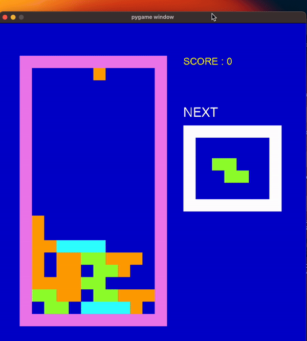

# Tetris Game with Pygame

This project is a Tetris game implemented in Python using the Pygame library. It includes a parent tetromino class and five subclasses for each Tetris figure. To play the game, run play.py.

### Example Render

### Instructions:

- Use the left, right, and down arrow keys to move the tetromino left, right, and down respectively.
- Use the 'D' key to rotate the tetromino 90 degrees clockwise.
- Use the 'S' key to rotate the tetromino 180 degrees clockwise.
- Use the 'A' key to rotate the tetromino 270 degrees clockwise.
### Features:

- Random selection of tetrominos for gameplay.
- Continuously falling tetrominos.
- Removal of full lines when a line is completely filled.
- Score tracking.
- Game over detection.
- Display of the next tetromino to be played.

